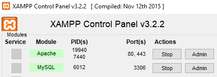
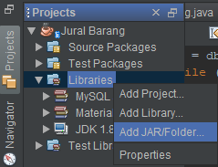
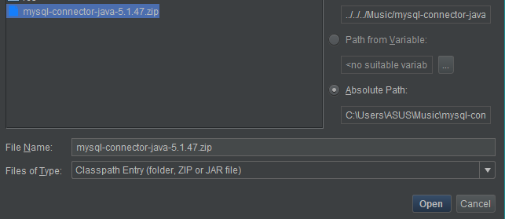
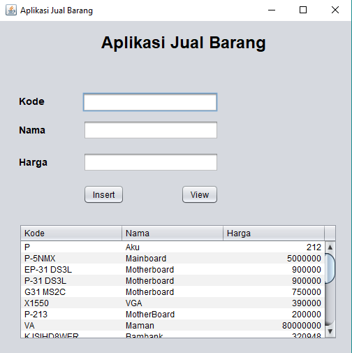

# oop-lab-les-8
This project contain exercieses form oop lab leeson 8 about JDBC (Java Database Connectivity)

## Download

### XAMPP
You can download XAMPP here [XAMPP](https://www.apachefriends.org/download.html)

### JDBC
You can download lates here [JDBC MySQL Connector](https://dev.mysql.com/get/Downloads/Connector-J/mysql-connector-java-5.1.47.zip)

## Setup
Before you using this repository you must create databases called `db_penjualan` and on this database include one table called `tabel_penjualan`,
so we must create it first. Follow intruction bellow to create.

###Configure XAMPP
Make sure your xampp was open and MySql and Apache was already Start like bellow



### Create Database
create `db_penjualan`
```sql
  CREATE DATABASE db_penjualan;
```
### Crate Table
now you must create `tabel_penjualan`
```sql
CREATE TABLE tabel_penjualan(
    kode VARCHAR(20),
    nama VARCHAR(20),
    harga INT
 );
```

### Install JDBC in NetBeans
one step closer before you run this repository, you must add `JDBC` which you already downloaded
Now open Project navigation on left side of IDE, you can find `Libraries` directory right click and select `Add JAR/Folder...`


after that you'll meet new dialog, now you find and selected library which you've downloaded before, and lick `Open` 
and you just waiting until the library already added


## Demo

this is the program demo, remember before you run the program make sure your `xampp` was already start `MySQL` and `Apache`
and this is the result


